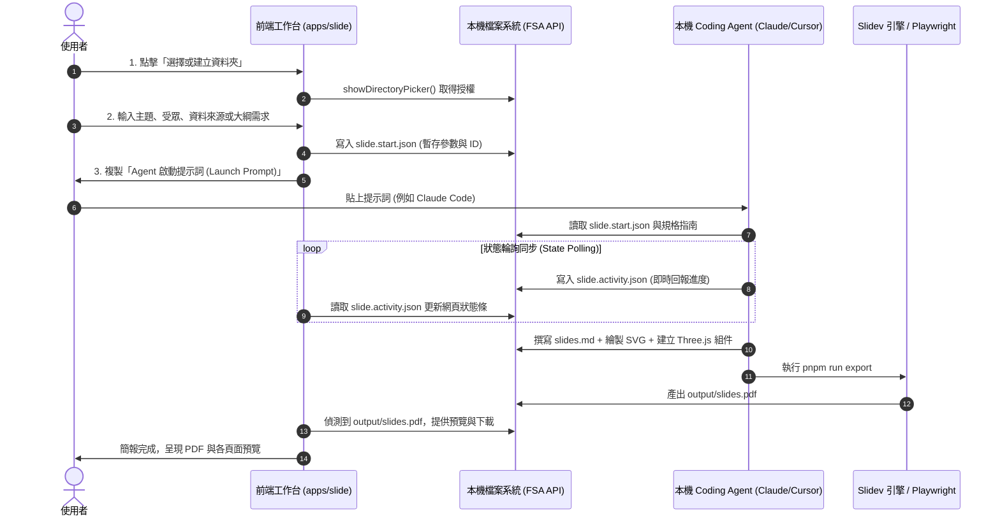

# Slide Studio 實作計畫 (PLAN.md)

本文件是 `apps/slide`（簡報子應用）的完整開發與實作計畫。

---

## 一、產品願景與定位

**Slide Studio** 是一個遵循 **AOFA (Agent Offload Front Architecture)** 模式的現代簡報生成與編輯工作台：
1. **純靜態前端工作台**：部署於 `/<repo>/slide/`（如 `https://aofa.tigernaxo.com/slide/`），不建置後端伺服器、不呼叫雲端付費 API。
2. **通訊機制極簡化**：完全依賴瀏覽器標準 **File System Access API (`showDirectoryPicker()`)** 與本機檔案輪詢，**不需要架設任何本機 Daemon 或 Companion（無須 packages/video-agent 形式的複雜常駐程序）**。
3. **Slidev + Agent 前端能力**：
   - 以 **Slidev** 為核心引擎（Markdown 驅動、Vue 3 組件生態、Tailwind CSS）。
   - 充分發揮 Coding Agent 的強大前端能力：動態撰寫 **HTML 排版**、繪製精密 **SVG 圖表/架構圖**、嵌入 **Three.js 3D 視覺/資料視覺化** 與 Canvas 動效。
4. **標準向量 PDF 輸出**：利用 Slidev 內建的 Playwright 截幀/向量列印管線，在使用者本機一鍵輸出無損向量 PDF 簡報。

---

## 二、前後端溝通與工作模式 (AOFA Pattern)



---

## 三、Sub-App 目錄架構規劃 (對齊 AGENTS.md 規範)

```text
apps/slide/
├── src/                         # 前端工作台原始碼 (Vue 3 + Tailwind CSS)
│   ├── components/              # 視圖組件
│   │   ├── ProjectPicker.vue    # 本機 FSA 目錄授權與引導
│   │   ├── PromptLauncher.vue   # 提示詞生成與複製面板
│   │   ├── ActivityBanner.vue   # Agent 即時進度動態列 (輪詢 slide.activity.json)
│   │   ├── SlideDeckView.vue    # 簡報分頁卡片預覽與 Markdown 檢視
│   │   └── PdfViewer.vue        # PDF 成品預覽與下載
│   ├── lib/                     # 工具庫
│   │   ├── fsa.ts               # File System Access API 讀寫封裝
│   │   ├── activity.ts          # 輪詢狀態管理 (slide.activity.json)
│   │   └── slide-parser.ts      # slides.md 前端簡易解析 (分頁拆解、frontmatter 提取)
│   ├── types/                   # protocol.ts (由 specs/*.schema.json 自動編譯產出)
│   ├── App.vue                  # 根組件
│   └── main.ts
│
├── specs/                       # 簡報協議單一來源 (Single Source of Truth)
│   ├── project.schema.json      # slide.project.json 定義 (主題、風格、頁數、配置)
│   ├── activity.schema.json     # slide.activity.json 定義 (即時工作狀態、當前處理頁數)
│   ├── workflow.json            # 簡報製作步驟狀態機 (init -> outline -> draft -> visual -> export)
│   ├── workflow.schema.json     # workflow 自身的校驗 Schema
│   └── examples/                # valid/ 與 invalid/ 規格用例
│
├── template/                    # 供 Agent 在本機初始化的 Slidev 專案範本
│   ├── components/              # 預先封裝的高質感 Vue 視覺組件
│   │   ├── ThreeGlobe.vue       # Three.js 3D 地球視覺組件
│   │   ├── ThreeParticles.vue   # Three.js 粒子流動背景
│   │   └── SvgFlowChart.vue     # 動態 SVG 流程圖容器
│   ├── scripts/                 # 本機輔助腳本
│   │   ├── validate.mjs         # 驗證 slides.md 語法與 schema 合法性
│   │   ├── export-pdf.mjs       # 調用 Slidev CLI 匯出高解析 PDF (封裝 playwright 截幀)
│   │   └── state.mjs            # 原子更新 slide.project.json / slide.activity.json
│   ├── slides.md                # 初始 Slidev 範本簡報
│   ├── package.json             # 本機專案依賴 (@slidev/cli, three, playwright 等)
│   ├── AGENTS.md                # 專案內 Agent 工作準則 (禁止改壞版面、SVG/Three.js 撰寫守則)
│   └── slide.project.json       # 專案設定檔
│
├── skills/                      # Agent Skills
│   └── slidev-deck/
│       ├── SKILL.md             # 技能主進入點 (規格、步驟、指令)
│       ├── outline-guide.md     # 簡報架構與分頁節奏規劃指南
│       ├── visual-guide.md      # HTML/Tailwind、SVG、Three.js 組件撰寫範例與指南
│       └── export-guide.md      # PDF 匯出與疑難排解指南
│
├── tests/                       # Slide 專屬測試套件
│   ├── specs.test.mjs           # Schema 與 workflow 正反例測試
│   ├── template.test.mjs        # 驗證範本安裝、驗證腳本與 PDF 匯出邏輯
│   └── ui.test.mjs              # 工作台前端 FSA 檔案互動測試
│
├── tools/                       # Slide 專屬建置工具
│   ├── gen-types.mjs            # 由 specs/*.schema.json 編譯產生 src/types/protocol.ts
│   └── build-api.mjs            # 打包 slidev-deck.zip 與 template.zip 至 dist/api/
│
├── SPEC.md                      # 完整設計規格書
├── PLAN.md                      # 本實作計畫
├── vite.config.ts               # appConfig(import.meta.dirname, 'slide')
└── tsconfig.json                # 獨立 TypeScript 設定
```

---

## 四、核心功能與亮點設計（基於 Slidev 生態系深度客製）

參考 [slidevjs/slidev](https://github.com/slidevjs/slidev) 官方核心設計，我們將 Slidev 的全部原生優勢與 Coding Agent 的前端生成能力完美融合：

### 1. Slidev 原生能力全面解放
- **宣告式版面佈局 (Built-in Layouts)**：
  - Frontmatter 直接宣告版型：`layout: cover`（封面）、`layout: two-cols`（雙欄對比）、`layout: center`（居中）、`layout: quote`（名言）、`layout: fact`（關鍵數字事實）等。
  - Agent 能依內容重要性精準選擇最適版型，不必從零手寫 CSS Grid。
- **組件零配置自動註冊 (Component Auto-import)**：
  - Slidev 自動偵測 `./components/*.vue` 並全域註冊。
  - Agent 自製的進階視覺（如 `<ThreeGlobe />`、`<ThreeParticles />`、`<SvgArchitecture />`）在 `slides.md` 內直接使用標籤引用，完全無需手動 `import`。
- **逐步點擊與動效揭示 (Clicks & Motion)**：
  - 支援 `v-click`、`v-after`、`v-click="[1, 3]"` 指令，讓 Agent 規劃簡報演說節奏，逐點淡入或強調關鍵字。
  - 整合 `@vueuse/motion`（`v-motion`），支援頁面元素進場與退場的物理彈簧過渡。
- **豐富圖標與圖表系統**：
  - **Iconify 內建支援**：Agent 可直接以標籤調用數萬個向量圖示（如 `<carbon:cloud-service-management />`、`<ri:cpu-line />`）。
  - **Mermaid.js 原生支援**：透過 ````mermaid 語法直接輸出高品質流程圖、甘特圖與時序圖。
- **程式碼高亮與實時演示 (Shiki & Monaco)**：
  - 針對技術主題簡報，支援精準語法高亮、行標記（`{2-4|6}`）、Monaco 實時編輯與 Twoslash 型別懸停提示。
- **講者備忘錄 (Speaker Notes)**：
  - 每一頁底部透過 `<!-- notes -->` 撰寫演講口稿與重點提詞，演講者模式（Presenter Mode）開箱即用。

### 2. Slidev + Three.js / WebGL / SVG 視覺組合技
- **HTML + Tailwind CSS**：自由發揮 Bento Grid、卡片網格與毛玻璃特效。
- **向量 SVG 圖解**：針對複雜業務架構，Agent 直接在 Markdown 內嵌原創 SVG，縮放永不失真。
- **Three.js 3D 視覺組件庫**：
  - 專案範本預先提供高質感、輕量化的 Vue 3 封裝：
    - `ThreeGlobe.vue`：可旋轉的科技感 3D 點陣地球。
    - `ThreeParticles.vue`：隨滑鼠互動或時間律動的粒子背景。
    - `ThreeCubeGrid.vue`：科技架構立體方塊陣列。
  - Agent 可在封面頁、轉場頁或數據頁調用，創造媲美 Apple 發布會等級的簡報質感。

### 3. 免後端的高品質 PDF / 圖片 / PPTX 匯出機制
- **Slidev Headless 匯出引擎**：
  Slidev 底層由 Playwright 驅動，能直接在 Headless 瀏覽器環境中以向量列印方式輸出：
  ```bash
  # 匯出標準向量 PDF
  pnpm run export --output output/slides.pdf
  
  # 可選保留點擊動畫步驟（每步一頁）
  pnpm run export --output output/slides-animated.pdf --with-clicks
  
  # 亦支援匯出每頁高清 PNG
  pnpm run export --format png --output output/slides-png
  ```
- **FSA 閉環協同**：
  - 使用者在工作台輸入主題 ➔ Agent 在本機建立並編寫 Slidev 專案 ➔ Agent 執行匯出腳本產出 `output/slides.pdf`。
  - 前端工作台透過 File System Access API 偵測到產物，立即啟用網頁內嵌預覽與一鍵下載。

---

## 五、分階段實施計畫 (Phase Roadmap)

### Phase 1：協議與專案範本建置 (Specs & Template)
1. 定義 `specs/project.schema.json`、`specs/activity.schema.json` 與 `specs/workflow.json`。
2. 建立 `tools/gen-types.mjs`，產出 `src/types/protocol.ts`。
3. 建立 `template/`：
   - 建立基本的 Slidev 專案結構（`package.json`, `slides.md`, `components/`）。
   - 封裝 2~3 個可重用的 Three.js / SVG 範例組件。
   - 撰寫本機腳本 `scripts/export-pdf.mjs` 與 `scripts/state.mjs`。
4. 撰寫 `tests/specs.test.mjs` 確保 Schema 驗證 100% 通過。

### Phase 2：Agent 指引與發布工具 (Skills & Tools)
1. 撰寫 `skills/slidev-deck/`：
   - `SKILL.md`（Agent 讀取的第一入口）。
   - `visual-guide.md`（提供 HTML, SVG, Three.js 的撰寫規格與範例）。
2. 建立 `tools/build-api.mjs`：
   - 打包 `slidev-deck.zip` 與 `template.zip` 至 `dist/api/`。

### Phase 3：前端工作台開發 (Vue 3 Workbench)
1. 開發 `src/components/ProjectPicker.vue`：
   - 支援 File System Access API 授權本機目錄。
   - 產生 `slide.start.json`。
2. 開發 `src/components/PromptLauncher.vue`：
   - 依據使用者輸入的主題生成引導 Agent 工作的啟動提示詞。
3. 開發 `src/components/ActivityBanner.vue`：
   - 輪詢 `slide.activity.json`，顯示 Agent 正在撰寫哪一頁或正在匯出 PDF。
4. 開發 `src/components/SlideDeckView.vue` 與 `src/components/PdfViewer.vue`：
   - 預覽 `slides.md` 內容與檢視下載 `output/slides.pdf`。

### Phase 4：測試、驗證與全站整合 (Integration & Polish)
1. 整合至根目錄 `package.json` 的 `pnpm test` 與 `pnpm run build`。
2. 確保 `pnpm run typecheck` 零錯誤。
3. 驗證全站部署與在 `https://aofa.tigernaxo.com/slide/` 運作正常。
