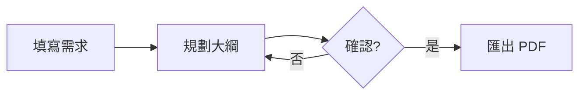

# 簡報視覺增強指南 (visual-guide.md)

本指南指導 Agent 如何結合前端視覺能力與 Slidev 生態系打造世界級質感的簡報。

---

## 1. 原生向量 SVG 繪製守則

- **內嵌 SVG 代碼**：直接在 `slides.md` 內嵌 `<svg viewBox="0 0 800 400">...</svg>`，利用 Tailwind 樣式自適應容器。
- **統一色彩基調**：
  - 邊框：`#38bdf8`（Sky 400）、`#34d399`（Emerald 400）、`#f59e0b`（Amber 500）。
  - 文字：`#f8fafc`（Slate 50）、`#94a3b8`（Slate 400）。
  - 背景：`#1e293b`（Slate 800 半透明）。
- **箭頭與連接線**：使用 `<defs><marker id="arrow">...</marker></defs>` 保持架構圖與流程圖整潔美觀。
- **SVG 屬性照常寫**：Slidev 的 UnoCSS attributify 原本會把 `font-size="16"`、`stroke="red"` 這類屬性當成樣式（`font-size="16"` 會變成 4rem，大四倍）。範本的 `uno.config.ts` 已經擋掉這些屬性，**不要刪除或改寫這個檔案**；`pnpm run check` 的截圖中 SVG 文字突然變得很大，多半是這個檔案不見了。

---

## 2. Mermaid 圖表（流程圖、時序圖、簡單圖表）

Slidev 內建 Mermaid：在 `slides.md` 寫 ` ```mermaid ` 程式碼區塊，就會畫成 SVG（PDF 中是向量）。節點、連線多的圖用 Mermaid 比手寫 SVG 快，也不用自己算座標；需要精確排版或特殊造型時才手寫 SVG。

````markdown

````

- **常用圖型**：`flowchart`（流程圖、架構圖）、`sequenceDiagram`（時序、API 呼叫）、`stateDiagram-v2`（狀態）、`gantt`（時程）、`timeline`（里程碑）、`mindmap`（心智圖）、`pie`、`xychart-beta`（長條、折線）、`quadrantChart`（四象限）、`sankey-beta`（流量）。
- **大小**：`{scale: 0.8}` 縮放整張圖。橫向的 `flowchart LR` 很寬，放在 `two-cols` 的半欄會蓋到另一欄；橫向圖放整頁寬度，半欄裡用 `flowchart TD` 並控制在 5 個節點左右。`pnpm run check` 只抓超出頁面的內容，**欄位之間互相重疊要看截圖確認**。
- **手繪風格**：`{look: 'handDrawn'}`，搭配下方的 `<RoughSketch>` 可以做出白板風格的簡報。範本的 `setup/mermaid.ts` 固定了手繪線條的種子，檢查截圖、PDF 與網頁版的線條才會一致；其他全域 Mermaid 設定（例如 `theme: 'neutral'`）也寫在這個檔案。
- **文字**：節點文字要短（10 個字以內），長說明放在投影片的 HTML 文字裡；中文標點會讓節點變寬。

---

## 3. 手繪風格 `<RoughSketch>`

範本的 `components/RoughSketch.vue` 把一般 SVG 畫成手繪風格（底層是 Rough.js）：照常寫 `rect`、`circle`、`ellipse`、`line`、`polyline`、`polygon`、`path`，組件會換成手繪線條；`text`、`marker` 與其他元素保持原樣。輸出仍是 SVG，PDF 中是向量。

```html
<div class="mx-auto w-80 text-sky-500">
  <RoughSketch viewBox="0 0 360 200">
    <defs>
      <marker id="tip" viewBox="0 0 10 10" refX="6" refY="5" markerWidth="6" markerHeight="6" orient="auto-start-reverse">
        <path d="M 0 1 L 8 5 L 0 9 z" fill="currentColor" />
      </marker>
    </defs>
    <rect x="20" y="65" width="120" height="70" fill="#bae6fd" />
    <text x="80" y="106" font-size="18" text-anchor="middle" fill="currentColor">草稿</text>
    <line x1="145" y1="100" x2="210" y2="100" marker-end="url(#tip)" />
    <circle cx="275" cy="100" r="55" fill="#bbf7d0" data-fill-style="cross-hatch" />
  </RoughSketch>
</div>
```

- **必填 `viewBox`**，寬度由外層容器決定（例如 `w-80`、`w-full`）。
- **線條**：`stroke`（預設 `currentColor`，所以外層的 `text-sky-500` 就是線條色）、`stroke-width`（預設 2）、`stroke-dasharray`；`marker-end` / `marker-start` 會保留，箭頭照常用 `<marker>`。
- **填色**：`fill` 預設畫成斜線（hachure）；單一形狀用 `data-fill-style` 改成 `solid`、`cross-hatch`、`zigzag`、`dots`，整張圖用 `fill-style` 屬性。`data-roughness` 調單一形狀的潦草程度（0 是直線，預設 1.2）。
- **固定的線條**：同樣的內容每次都畫出同樣的線條（`seed` 預設 1）；想換一種抖動就改 `:seed="2"`。
- **`rect` 沒有圓角**（`rx` 會被忽略），手繪風格本來就不需要。
- **逐步出現**：`v-click` 加在 `<RoughSketch>` 或外層元素上，不要加在裡面的 SVG 元素上（組件畫出的是複本，裡面的 `v-click` 不會作用）。要分步驟出現，就拆成幾個 `<RoughSketch>`。
- 文字仍是一般 SVG 文字；需要手寫感時用較圓潤的字型即可，不要把文字畫成線條。

---

## 4. Three.js / WebGL 3D 組件規範

- **自動載入機制**：Slidev 自動將 `components/*.vue` 註冊為全域組件，Agent 無需在 Markdown 中寫 `import`。
- **可重用 3D 組件範例**：
  - `<ThreeGlobe />`：旋轉線框地球，適合展示全球化、雲端運算、網路通訊主題。
- **撰寫新的 3D 組件注意事項**：
  - 必須在 `onBeforeUnmount` 執行 `cancelAnimationFrame` 與 `renderer.dispose()`，避免記憶體洩漏與多頁切換卡頓。
  - 建立 renderer 時設定 `new THREE.WebGLRenderer({ alpha: true, antialias: true, preserveDrawingBuffer: true })`：`alpha` 讓畫布融入主題背景；`preserveDrawingBuffer` 讓匯出 PDF 時畫面不會是空白。
  - WebGL 畫面在 PDF 中是點陣圖（不是向量），只用來營造氛圍；需要讀的文字與數據放在 HTML / SVG 裡。

---

## 5. Clicks 與動畫過渡

- **逐步列點**：用 `<v-clicks>` 包住清單，每按一次出現一項：
  ```markdown
  <v-clicks>

  - 項目一
  - 項目二

  </v-clicks>
  ```
- **單一元素**：在元素上加 `v-click`，例如 `<div v-click>第二步才出現</div>`。
- **指定步驟**：`v-click="2"` 在第 2 次點擊時出現；`v-after` 與前一個元素同時出現。
