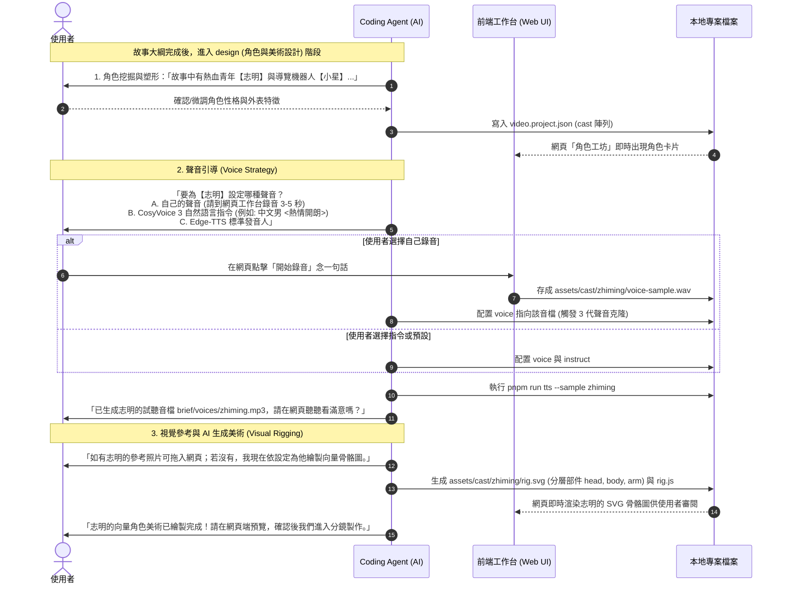

# 講故事工作台 — 角色工坊與 AI 協同引導規劃書 (Story Cast Studio & Agent Guidance Plan)

> **目標子專案**：`apps/video`（故事影片 `project.kind === 'story'`）  
> **核心宗旨**：為故事影片提供可視化的角色管理中心與雙向 AI 協同引導工作流，涵蓋角色設定、聲音實驗室（錄音/Edge-TTS/CosyVoice 3 指令）與視覺畫廊（參考概念圖/AI 生成 SVG 骨骼圖）。  
> **架構原則**：AOA (Agent-Offloaded Architecture) 前端零後端 + 原生瀏覽器能力（零新增第三方套件依賴） + Ponytail 極簡原則。  
> **狀態**：已確認規劃 (Approved Plan)

---

## 1. 介面架構與互動流 (UI/UX Design)

當專案為故事模式（`project.kind === 'story'`）時，主工作台導航區提供雙視圖切換：

```text
[ 🎬 分鏡故事板 (Scenes) ]  |  [ 🎭 角色工坊 (Cast: N 人) ]
```

切換至「角色工坊」後，介面呈現**左側角色名冊**、**右側角色工作台**的響應式雙欄佈局：

```text
┌───────────────────────────┬─────────────────────────────────────────────────────────┐
│ 🎭 登場角色清單            │ 角色詳情：志明 (id: zhiming)                             │
│ ┌───────────────────────┐ │ ─────────────────────────────────────────────────────── │
│ │ 👤 志明 (主角)         │ │ 📝 角色設定                                              │
│ │ 🔊 CosyVoice3 [克隆]  │ │   角色名稱：[ 志明 ]      識別碼：zhiming                 │
│ │ 🎨 SVG 骨骼已就緒      │ │   外觀個性：[ 20歲青年，熱血開朗，常穿紅色連帽衫 ]       │
│ └───────────────────────┘ │                                                         │
│ ┌───────────────────────┐ │ 🎙️ 聲音實驗室 (Voice Console)                          │
│ │ 👤 小星 (導覽機器人)   │ │   [ 🎤 線上錄音 ] [ 🔊 Edge-TTS ] [ ⚡ CosyVoice 3 ]       │
│ │ 🔊 Edge-TTS (曉晨)    │ │   ------------------------------------------------------- │
│ └───────────────────────┘ │   ● 模式 A：使用自訂錄音做聲音克隆 (3-5秒 WAV)          │
│                           │     [ ● 開始錄音 ]  [ ▶️ 試聽錄音 ]  路徑: voice-sample.wav │
│ [ ➕ 新增登場角色 ]       │   ● 模式 B：CosyVoice 3 自然語言指令                      │
│                           │     發音人/指令：[ 中文男 <用熱情開朗的大學生語氣> ]    │
│                           │     [ 🎧 合成試聽 ] (呼叫 tts.mjs --sample zhiming)       │
│                           │                                                         │
│                           │ 🎨 視覺與美術設定 (Visual Assets)                       │
│                           │   ┌─────────────────────┐   ┌─────────────────────────┐ │
│                           │   │ 🖼️ 參考概念圖 (Ref)  │   │ 🤖 AI 生成 SVG 骨骼圖   │ │
│                           │   │ [ 上傳 / 拖曳圖片 ] │   │ (rig.svg 即時渲染)      │ │
│                           │   │ reference.png       │   │ ✔️ 包含 head, arm 等部位 │ │
│                           │   └─────────────────────┘   └─────────────────────────┘ │
│                           │   [ 📋 複製提示詞：讓 Agent 依設定繪製角色 SVG 骨骼 ]    │
└───────────────────────────┴─────────────────────────────────────────────────────────┘
```

---

## 2. 核心功能模組

### 模組 A：聲音實驗室（Voice Console）
1. **瀏覽器原生麥克風錄音（聲音克隆樣本）**：
   - 使用標準 `navigator.mediaDevices.getUserMedia` 與 `MediaRecorder`，**零新增 npm 依賴**。
   - 錄製完成後，透過 File System Access API 直接將音訊以 WAV 格式寫入 `@/assets/cast/<id>/voice-sample.wav`。
   - 角色 `provider` 設為 `cosyvoice3`，`voice` 指向 `@/assets/cast/<id>/voice-sample.wav`，自動觸發 3 代零樣本克隆。
2. **Edge-TTS 模式**：
   - 提供繁體中文精選發音人選單（`zh-TW-HsiaoChenNeural`、`zh-TW-YunJheNeural` 等）。
3. **CosyVoice 3 模式（情緒指令 + 預設發音人）**：
   - 支援基礎發音人 + 自然語言情緒/風格指令輸入框（如：`中文男 <用專業嚴肅的紀錄片旁白語氣>`、`<用台語說>`）。
4. **一鍵試聽 (Audition)**：
   - 呼叫 `pnpm run tts --sample <id>` 生成試聽檔 `brief/voices/<id>.mp3` 並即時播放。

### 模組 B：視覺與角色美術（Visual & Rig Gallery）
1. **參考概念圖 (Reference Art)**：
   - 支援將照片、動漫插圖或手繪稿拖曳儲存至 `@/assets/cast/<id>/reference.png`。
   - 前端透過 `useFileUrl.ts` 即時產生 Blob URL 預覽，作為角色風格基準。
2. **AI 生成圖 / SVG 程式性骨骼圖 (Rigged SVG)**：
   - 即時渲染 `@/assets/cast/<id>/rig.svg`。
   - 可檢視分層部件（如 `<g id="head" data-pivot="...">`、`<g id="body">`）。
3. **提示詞工作台 (Prompt Launcher for Agent)**：
   - 一鍵複製格式化指令傳給 Coding Agent：「*請依據角色【志明】的外觀描述與參考圖，在 `@/assets/cast/zhiming/rig.svg` 繪製符合骨骼規範的分層 SVG 組件...*」。

---

## 3. AI（Coding Agent）雙向協同引導流程

在故事模式的 `design`（角色與美術設計）階段，Coding Agent 將遵循以下 SOP 主動引導使用者：



---

## 4. 檔案變更與新增清單 (Implementation Plan)

| 檔案路徑 | 類型 | 職責 |
|---|---|---|
| `apps/video/docs/story-cast-studio-plan.md` | 文件 | 本規劃書 |
| `apps/video/src/components/CastPanel.vue` | 組件 | 角色名冊列表與新增/刪除角色控制項 |
| `apps/video/src/components/CastEditor.vue` | 組件 | 角色編輯面板（設定、VoiceStudio、ArtStudio） |
| `apps/video/src/components/VoiceStudio.vue` | 組件 | 錄音控制器、CosyVoice 3 自然語言指令輸入、Edge-TTS 選單與試聽 |
| `apps/video/src/components/ArtStudio.vue` | 組件 | 參考圖拖曳上傳與 SVG 骨骼圖即時渲染預覽 |
| `apps/video/src/App.vue` | 視圖 | 在故事模式（`kind === 'story'`）加入「分鏡腳本 / 角色工坊」Tab 切換 |
| `apps/video/template/AGENTS.md` | 規範 | 加入 Agent 在故事模式引導角色塑形、錄音與 SVG 繪製的 SOP 指引 |
| `apps/video/skills/story-video/script-guide.md` | Skill | 補充角色聲音克隆示範語句與 SVG 動畫掛載規範 |
| `apps/video/tests/web/ui.test.mjs` | 測試 | 前端工作台新增與切換角色工坊的單元測試 |

---

## 5. 驗證步驟
1. 建立故事模式專案，確認工作台顯示「分鏡腳本」與「角色工坊」切換標籤。
2. 測試在「角色工坊」中新增角色（志明）、設定外觀個性。
3. 測試聲音設定（CosyVoice 3 自然語言指令輸入、切換 Edge-TTS、錄音介面展示）。
4. 測試參考圖展示與 SVG 骨骼預覽渲染。
5. 執行 `pnpm run typecheck` 與 `pnpm test` 確保零報錯。
