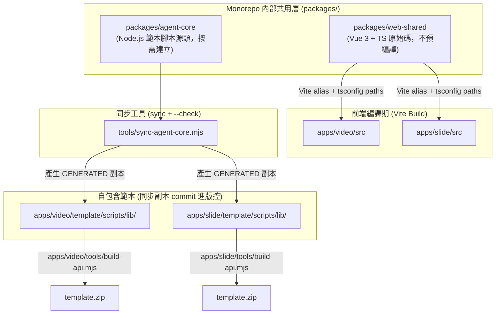

# 跨子應用共用架構與專案結構演進規劃書 (Monorepo Shared Architecture Plan)

> **目標範疇**：全平台架構（`apps/*`、`packages/*`、`tools/*`）  
> **架構原則**：AOA (Agent-Offloaded Architecture) + DRY (Don't Repeat Yourself) + Context 隔離 + YAGNI  
> **狀態**：rev.3：階段一（`packages/web-shared`）與影片拆分（§8）已實作  
> **影片拆分**：`apps/video` 已拆成 `apps/story`、`apps/product`，共用部分下沉為 `packages/video-core`（見 §8）。

---

## 1. 背景與核心挑戰

隨著平台陸續擴充子應用（如 `apps/video`、`apps/slide` 以及未來的新應用），開發與維護時面臨以下兩難：

1. **重複代碼增加**：
   - **前端層**：`src/lib/fsa.ts`（File System Access API）、`src/lib/activity.ts`（活動輪詢）在 video 與 slide 各有一份，功能相同但 API 已開始分歧。
   - **本機範本層**：目前重複**極少**——`apps/slide/template/scripts/lib/` 只有 `schema.mjs` 一個檔案；`cli.mjs`、`validate.mjs`、`state.mjs`、`tts-providers.mjs` 等只存在於 video 範本。重複風險在「下一個需要這些工具的範本」出現時才會成真。
2. **Context 隔離約束**：
   - 根據 `AGENTS.md` 規範，各子應用之間嚴禁跨目錄交互引用（`apps/video` 不可 import `apps/slide`），以避免 Coding Agent 讀入非必要代碼污染 Context。
3. **終端使用者獨立性（Self-contained Templates）**：
   - 終端使用者本機解壓 `template.zip` 後，並不存在整個 Monorepo 的 `packages/`，因此範本內的執行腳本必須能獨立運作。

---

## 2. 現況比對：哪些模組適合共用？

以下差異量為 `diff apps/video/... apps/slide/...` 的實測結果（取代 rev.1 中的估計百分比）。

### 2.1 立即可共用（階段一）

| 模組 | 目前位置 | 實測差異 | 判斷與合併要點 |
|---|---|---|---|
| **File System Access (FSA)** | `apps/{video,slide}/src/lib/fsa.ts`（90 / 85 行） | 41 行差異 | 與業務解耦，適合抽出。需先統一 API：video 有 `writeFile(Blob \| BufferSource \| string)`、slide 只有 `writeText`；slide 的 `listFiles(root, path = '')` 支援根目錄；`ensurePermission` 的 `prompt` 預設值不同；slide 多處 `as any` 應改回正確型別。 |
| **Activity 輪詢** | `apps/{video,slide}/src/lib/activity.ts`（34 / 38 行） | 20 行差異 | 讀取 `*.activity.json`、`ago()`、stale 判定。共用庫不應 import 各 app 的 `store`；activity ref 改由呼叫端傳入。 |

### 2.2 暫緩共用（前提條件未滿足）

| 模組 | 目前位置 | 暫緩原因 | 解除條件 |
|---|---|---|---|
| **CopyButton.vue** | `apps/{video,slide}/src/components/` | 兩份本質不同：video 依賴 `Icon.vue` 與 `btn-primary` / `btn-secondary` 樣式類別；slide 為行內 Tailwind class。共用的是「行為」而非「元件」。 | 平台先有共用的設計基礎（Icon、按鈕樣式），或改為只共用 `useCopy()` composable。 |
| **`audio.ts`（重取樣）** | 僅 `apps/video/src/lib/audio.ts` | 只有一個使用者，不構成重複。 | 第二個 app 需要音訊處理時。 |
| **範本腳本（`cli.mjs`、原子寫入、`validate.mjs`）** | 僅 `apps/video/template/scripts/` | slide 範本沒有對應檔案。 | 第二個範本需要時，依 §4 Layer B 抽取。 |
| **Ajv Schema 載入器（`schema.mjs`）** | `apps/{video,slide}/template/scripts/lib/schema.mjs` | 兩份都與業務耦合：video 版 import `./project.mjs` 的 `UsageError`、`readJson`；slide 版內含 `PROJECT_FILE`、`ACTIVITY_FILE` 等常數。 | 先把業務常數移出，只剩「載入 `schemas/*.schema.json` + 格式化錯誤」的通用核心後再抽。 |
| **TTS 語音（CosyVoice 3 / Edge-TTS）** | `apps/video/template/scripts/cosyvoice/`、`lib/tts-providers.mjs` | slide 目前沒有任何 TTS 程式碼；且需區分「程式碼共用」與「服務共用」（見 §4 Layer C）。 | 第二個 app 實際需要語音時。 |

### 2.3 建置工具（Tooling Level）

| 工具 | 目前位置 | 判斷 |
|---|---|---|
| **TypeScript 型別產生器** | `apps/{video,slide}/tools/gen-types.mjs` | 兩份各有 `--check` 模式。可將編譯核心抽至 `tools/lib/schema-codegen.mjs`，各 app 保留薄殼設定。優先度低，可與階段一並行或延後。 |
| **Markdown 擷取** | 僅 `apps/video/tools/lib/markdown.mjs` | 單一使用者，暫不搬移；slide 的 Guide API 需要時再提升至 `tools/lib/`。 |

### 2.4 明確「不適合共用」的部分（保持獨立，避免過度抽象）

1. **`specs/*.schema.json` 與 `workflow.json`**：Video 定義鏡頭（`scenes`）、旁白（`narration`）、音訊（`audio`）；Slide 定義頁面（`slides`）、外觀（`theme`）、向量圖形（`diagram`）。業務模型完全不同，強行抽象只會讓 Schema 複雜脆弱。
2. **各 App 的主畫面與專屬組件**：如 `SceneEditor.vue`、`SlideDeckView.vue`、`PdfViewer.vue`。
3. **專屬產物管線腳本**：Video 的 `render-scene.mjs`、`assemble.mjs`；Slide 的 `slide-parser.ts`。

---

## 3. 共用手段的限制：不在受版控的原始碼與範本中使用 Symlink

**說明**：pnpm 本身會在 `node_modules/` 內建立連結（Windows 上為 junction，不需系統管理員權限），屬於可接受的工具鏈行為；Layer A 則改用 Vite alias + tsconfig `paths`，完全不經過連結。這裡排除的是**由 Git 追蹤的 symlink**，以及**範本目錄內的 symlink**：

| 維度 | 缺陷 |
|---|---|
| **Windows 權限限制** | 建立真正的符號連結需要系統管理員權限或開啟 Developer Mode，否則拋出 `EPERM`。 |
| **Git 跨平台風險** | `core.symlinks` 在 Windows 常為 false，symlink 會退化為只含路徑的純文字檔。 |
| **Zip 打包毀損** | `apps/*/tools/build-api.mjs` 以 `fflate` 打包 `template.zip` 時，symlink 可能被打成死連結或造成遞迴。 |
| **模組解析** | Node.js 依 realpath 解析 symlink，範本內的連結檔會在 monorepo 外尋找 `node_modules`，解壓後失效。 |

---

## 4. 分層共用架構設計

依「**運行環境與發布型態**」分為三層：



**依賴方向（硬性規則）**：`apps/*` → `packages/*` 允許；`packages/*` → `apps/*` 禁止；`apps/A` → `apps/B` 禁止；`packages/*` 之間的依賴必須在各自 `package.json` 宣告。

---

### Layer A：前端 Web UI 共用（原始碼套件 + 路徑別名）　✅ 已實作

* **適用範圍**：階段一只含 `fsa.ts`、`activity.ts`。UI 元件需等設計基礎統一（見 §2.2）。
* **實作機制**：
  1. 建立 `packages/web-shared`，**直接匯出 `.ts` / `.vue` 原始碼**，由各 app 的 Vite 編譯，不另設 build 步驟：
     ```json
     {
       "name": "@aoa/web-shared",
       "private": true,
       "type": "module",
       "exports": {
         "./fsa": "./src/fsa.ts",
         "./activity": "./src/activity.ts"
       }
     }
     ```
  2. **以路徑別名解析，不走 pnpm workspace 安裝**：各 app 沒有自己的 `package.json`（依賴集中在根目錄），且 `pnpm-workspace.yaml` 未列 `packages`。因此：
     - [`apps/vite.shared.ts`](../apps/vite.shared.ts) 的 `appConfig` 為所有 app 加上 `resolve.alias['@aoa/web-shared'] → packages/web-shared/src`；
     - 各 app `tsconfig.json` 加上 `"paths": { "@aoa/web-shared/*": ["../../packages/web-shared/src/*"] }`。
     `package.json` 的 `exports` 保留作為公開入口的宣告；日後若改為 workspace 安裝，import 路徑不需變動。
  3. 各 App 引入：
     ```typescript
     import { listFiles, writeText } from '@aoa/web-shared/fsa'
     import { useActivity } from '@aoa/web-shared/activity'
     ```
* **注意事項**：
  - **型別檢查**：`vue-tsc` 會沿著 `paths` 檢查被 import 的共用原始碼。File System Access API 的 DOM 型別補丁以 `declare global` 放在 `fsa.ts` 內，任何 import 它的 app 自動取得，不需在各 app 的 `env.d.ts` 重複宣告。
  - **Tailwind 掃描**：各 app 以 Tailwind v4 `@import "tailwindcss"` 自動偵測來源，掃描範圍不含 `packages/`。共用庫一旦含 Tailwind class，各 app 的 `src/style.css` 必須加上 `@source "../../../packages/web-shared/src";`，否則 production build 會遺漏樣式。
  - **API 最小化**：共用庫是 Agent 會讀入的 Context，只匯出確實被兩個以上 app 使用的函式。

---

### Layer B：本機範本腳本共用（Single Source of Truth + 同步副本）

> **啟動時機**：第二個範本實際需要某個腳本時才建立 `packages/agent-core`，並只抽該腳本。現階段不實作。

* **核心挑戰**：使用者下載的 zip 必須是純自包含專案；範本在開發與測試時也會被直接執行，因此不能只在打包時才產生共用檔。
* **實作機制**：
  1. **單一源頭**：`packages/agent-core/src/*.mjs`。
  2. **同步副本 commit 進版控**：`node tools/sync-agent-core.mjs` 將源頭複製到宣告需要它的範本 `scripts/lib/`，每個副本開頭加上：
     ```javascript
     // GENERATED from packages/agent-core/src/cli.mjs — do not edit; run `pnpm sync:agent-core`.
     ```
  3. **`--check` 模式防呆**（沿用 `gen-types.mjs --check` 慣例）：在各 app 的 `tests/specs.test.mjs`（`apps/video/tests/`、`apps/slide/tests/`）中斷言副本內容與源頭一致，防止有人手動修改副本造成脫鉤。
  4. **打包**：`apps/*/tools/build-api.mjs` 照常打包範本目錄，不需額外注入邏輯。
* **依賴契約**：
  - agent-core 檔案只可 import **Node 內建模組**與 **agent-core 內部的相對路徑**，不可 import 範本的業務模組（如 `./project.mjs`）。
  - 第三方依賴（如 `ajv`）由各範本 `package.json` 自行宣告；agent-core 的 `package.json` 記錄所需版本範圍，同步工具檢查範本是否滿足。
  - 業務常數（`PROJECT_FILE`、schema 清單等）以參數注入，不寫死。
* **與 `packages/video-agent` 的關係**：`packages/video-agent`（`agent-video-producer`）是 video 專用的本機 MCP server，維持原狀，**不**改名為 agent-core。若它日後需要使用 agent-core 的工具，以 `workspace:*` 依賴引用，不走同步副本機制。

---

### Layer C：本機常駐服務（TTS，未來）

* **區分兩件事**：
  - **程式碼共用**：TTS client 調度器（provider 介面、Edge-TTS / CosyVoice HTTP client）屬 Layer B，可放入 agent-core。
  - **服務共用**：CosyVoice 3 是整台機器單一實例的服務（`127.0.0.1:50000`、約 1.5GB 模型權重）。**不應**注入進每個範本——否則兩個範本可能帶著不同版本的服務爭搶同一埠。
* **建議方向**：將 CosyVoice 服務做成使用者安裝一次的獨立工具（例如 `packages/tts-server`，提供 install / start / health 指令，並帶版本協商的 `/health` 端點），範本只附 client 並在偵測不到服務時提示安裝。
* **啟動時機**：第二個 app（如 slide 演講者導覽）實際需要語音時。

---

## 5. 推薦目錄結構（階段一完成後）

```text
aoa/
├── packages/
│   ├── web-shared/               # [新] 前端共用庫（原始碼直接匯出）
│   │   ├── src/
│   │   │   ├── fsa.ts
│   │   │   └── activity.ts
│   │   └── package.json
│   │
│   ├── video-agent/              # [既有] video 專用本機 MCP server，不變
│   └── agent-core/               # [未來] 第二個範本需要時才建立（Layer B）
│
├── apps/
│   ├── portal/
│   ├── video/                    # import @aoa/web-shared
│   ├── slide/                    # import @aoa/web-shared
│   └── vite.shared.ts
│
└── tools/
    ├── build-platform-api.mjs
    └── lib/                      # [可選] schema-codegen.mjs（gen-types 核心）
```

---

## 6. 漸進式遷移步驟

### 階段一：前端共用工具 + 規範更新

1. **更新 `AGENTS.md`**（先於程式碼變更，讓 Agent 從第一個 commit 起就知道規則）：
   - `apps/*` 可 import `packages/*`；`packages/*` 不可 import `apps/*`；子 App 之間仍嚴格隔離。
   - 修改 `packages/web-shared` 時須同時跑所有使用它的 app 的檢查。
2. 建立 `packages/web-shared`（`package.json` 含 `exports`）。
3. 合併 `fsa.ts`：以 video 版為基礎（型別較嚴謹），納入 slide 的 `listFiles` 根目錄支援，`ensurePermission` 的 `prompt` 改為必填參數，移除 `as any`。
4. 合併 `activity.ts`：`useActivity(source)` 改為接收各 app store 的 activity ref（泛型保留各 app 的文件型別）；`ago()` 統一採 slide 版（30 秒內「剛剛」、1 分鐘內顯示秒數），時鐘 10 秒一跳。
5. 兩個 app 改用 `@aoa/web-shared`，刪除 `apps/*/src/lib/fsa.ts`、`activity.ts`。
6. 加上 Vite alias 與各 app tsconfig `paths`；移除 video `env.d.ts` 中改由 `fsa.ts` 提供的 FSA 型別宣告。

**完成定義**：
- `apps/video/src/lib/` 與 `apps/slide/src/lib/` 中已無 `fsa.ts`、`activity.ts`；
- `pnpm run typecheck`、各 app 測試、各 app build 全數通過；
- 兩個 app 的開啟資料夾、讀寫專案檔、activity 狀態顯示，手動冒煙測試正常。

**回滾**：單一 PR 完成；有問題直接 revert，各 app 恢復原本的本地檔案。

### 階段二（可選，低優先）：`gen-types` 核心抽取

1. 抽 `tools/lib/schema-codegen.mjs`，各 app 的 `tools/gen-types.mjs` 改為薄殼。
2. **完成定義**：兩個 app 的 `gen-types --check` 皆通過，產出的 `protocol.ts` 與抽取前逐位元組一致。

### 階段三（條件觸發）：Layer B / Layer C

- **觸發條件**：第二個範本需要 `cli.mjs`、原子寫入、schema 載入或 TTS。
- 依 §4 Layer B 建立 `packages/agent-core` 與 `tools/sync-agent-core.mjs`，只抽被需要的檔案。
- **完成定義**：`sync --check` 測試通過；將 `template.zip` 解壓到 monorepo **外**的空目錄，執行 `pnpm install` 與範本的 `validate` 腳本能獨立成功。

---

## 7. 風險與對策

| 風險 | 對策 |
|---|---|
| 共用庫改動影響多個 app | AGENTS.md 規定改 `packages/*` 時須跑所有消費端的 typecheck / test / build。 |
| 合併 API 時改壞既有行為 | 先為 `fsa.ts` 補上以 OPFS 執行的單元測試，再搬移。 |
| 同步副本被手動修改 | `--check` 測試 + GENERATED 檔頭。 |
| 過度抽象 | 「兩個以上實際使用者才抽」為硬性門檻；§2.2 的暫緩清單定期複查。 |

---

## 8. 已實作：`apps/video` 拆分為 `apps/story` 與 `apps/product`

rev.2 曾把拆分列為範圍外。使用者決定完整拆分後，依下列方式實作；兩種影片約 80% 的程式碼相同（store、scene 編輯、整個範本管線），因此觸發 §4 Layer B 的條件，共用部分下沉為 `packages/video-core`，不複製兩份。

| rev.2 待回答的問題 | 決定 |
|---|---|
| 使用者資料遷移 | 兩邊沿用 `video.project.json` 與 `project.kind`，舊專案不需轉換；沒有 kind 視為 product。在錯的工作台開啟時，提示並連到正確的工作台（配對存在 localStorage，同源共用，不需重新配對）。 |
| `packages/video-agent` | 維持單一 MCP server 支援兩種 kind：guide 依 kind 讀 `/api/product`、`/api/story`，`create_project` 依 kind 解壓對應範本。打包 guide 的腳本移到 `tools/bundle-video-agent-guide.mjs`，修正原本 packages→apps 的反向依賴。 |
| 重複成本 | Schema、範本、共用工作台（`web/`）、`build-video-api.mjs`、`gen-types.mjs` 都只有一份，在 `packages/video-core`。各 app 只有自己的 `workflow.json`（線性、無 `kinds`）、Skill、首頁步驟 2 表單、故事專屬的角色工坊元件與薄殼 `tools/build-api.mjs`。 |
| 公開 API 相容 | 新增 `/api/story/*`、`/api/product/*`。`/api/video/*` 由 `tools/build-platform-api.mjs` 組回拆分前的檔案配置：workflow 與拆分前逐字相同（兩種 kind 合併、帶 `kinds`），`index.json` 加上 `deprecated`。`tests/site/build.test.mjs` 斷言舊路徑全部存在。舊的 `/video/` 網址是選擇頁，保留 `#pair=` 轉交給選定的工作台；companion 的配對連結依專案 kind 指向 `/story/` 或 `/product/`。 |
| Portal 呈現 | 首頁改為 Slide、故事動畫、產品介紹影片三張卡片，各自連到 `/slide/`、`/story/`、`/product/`。 |

**尚未做（下一輪）**：範本依 kind 瘦身——故事範本仍帶有 `capture.mjs`、`login.mjs`，產品範本仍帶有 `rig.js`、`motion.js`。這些腳本彼此 import 交錯（`render-html`、`scene-plan`、`browser`），拆開風險較高，另行處理。目前兩個範本 zip 只差在 `schemas/workflow.json` 與產生的 `.claude/commands/`。
