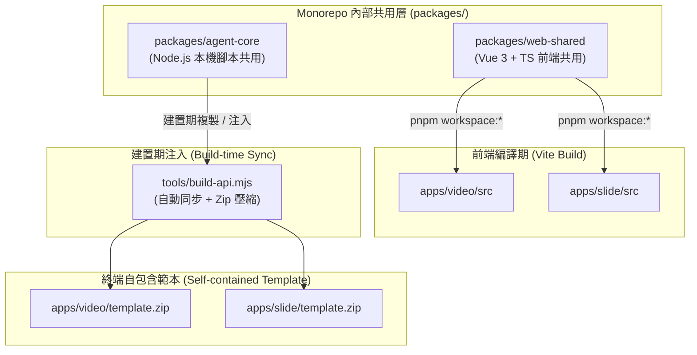

# 跨子應用共用架構與專案結構演進規劃書 (Monorepo Shared Architecture Plan)

> **目標範疇**：全平台架構（`apps/*`、`packages/*`、`tools/*`）  
> **架構原則**：AOA (Agent-Offloaded Architecture) + DRY (Don't Repeat Yourself) + Context 隔離  
> **狀態**：規劃中 (Draft)

---

## 1. 背景與核心挑戰

隨著平台陸續擴充子應用（如 `apps/video`、`apps/slide` 以及未來的新應用），開發與維護時面臨以下兩難：

1. **重複代碼增加**：
   - **前端層**：`fsa.ts`（File System Access API）、`activity.ts`（活動輪詢）、`CopyButton.vue` 等通用工具在各 App 間重複出現。
   - **本機範本層**：`cli.mjs`（參數解析）、`state.mjs`（狀態寫入/原子鎖）、`validate.mjs`（驗證腳本）功能高度相似，若分開維護容易造成功能修復與漏洞補丁脫節。
2. **Context 隔離約束**：
   - 根據 `AGENTS.md` 規範，各子應用之間嚴禁跨目錄交互引用（`apps/video` 不可 import `apps/slide`），以避免 Coding Agent 讀入非必要代碼污染 Context。
3. **終端使用者獨立性（Self-contained Templates）**：
   - 終端使用者本機解壓 `template.zip` 後，並不存在整個 Monorepo 的 `packages/`，因此範本內的執行腳本必須能獨立運作。

---

## 2. 深入比對分析：哪些模組適合共用？

經過對 `apps/video` 與 `apps/slide` 原始碼的逐行 Diff 比對，將現有模組分為「**高價值共用**」、「**建置期共用**」與「**明確不共用（專屬業務）**」三類：

### 2.1 高價值適合共用（高相似度、純基礎設施）

| 模組類別 | 目前位置 | 相似度 | 共用價值與抽取目標 |
|---|---|---|---|
| **File System Access (FSA)** | `apps/*/src/lib/fsa.ts` | **95%** | 封裝瀏覽器 `showDirectoryPicker`、遞迴歷遍、原子寫入與 OPFS 模擬。完全與業務解耦，抽至 `packages/web-shared/fsa.ts`。 |
| **Activity 輪詢監聽** | `apps/*/src/lib/activity.ts` | **90%** | 定期讀取 `*.activity.json`、計算最後動態距今時間（`ago()`）、判定逾時 stale（10分鐘）的 Vue Composable。抽至 `packages/web-shared/activity.ts`。 |
| **複製剪貼簿按鈕** | `apps/*/src/components/CopyButton.vue` | **85%** | 一鍵複製指令或文字，帶有成功反饋（✓ 已複製）。抽至 `packages/web-shared/components/CopyButton.vue`。 |
| **命令列解析基底 (CLI)** | `apps/video/template/scripts/lib/cli.mjs` | **95%** | 原生 Node.js 參數解析器（`parseArgs`）與腳本執行封裝（`run`、`UsageError`）。抽至 `packages/agent-core/cli.mjs`。 |
| **原子檔案寫入與鎖** | 各範本中的 `writeJsonAtomic` 與 `.video-agent.lock` 邏輯 | **90%** | 透過臨時檔案（`.tmp`）與 `renameSync` 確保 Agent/UI 併發時不會產生半截 JSON。抽至 `packages/agent-core/fs-atomic.mjs`。 |
| **Ajv Schema 載入器** | 各範本中的 `lib/schema.mjs` | **85%** | 自動載入 `schemas/*.schema.json`、編譯 Ajv 實例並輸出友善錯誤字串（`schemaErrors`）。抽至 `packages/agent-core/schema.mjs`。 |
| **TTS 語音引擎與適配器 (CosyVoice 3)** | `apps/video/template/scripts/cosyvoice/` 與 `lib/tts-providers.mjs` | **100% (跨應用通用)** | 語音生成為平台通用能力（Video 旁白、Slide 演講者導覽、未來的語音播客）。**本機服務具單一實例性**：全機共用同一 `127.0.0.1:50000` 服務與一份 1.5GB 模型權重，避免重複佔用顯存。客戶端調度協議抽至 `packages/agent-core/tts/`。 |

---

### 2.2 建置與開發工具共用 (Tooling Level)

| 工具名稱 | 目前位置 | 相似度 | 共用價值與抽取目標 |
|---|---|---|---|
| **TypeScript 型別產生器** | `apps/*/tools/gen-types.mjs` | **70%** | 透過 `json-schema-to-typescript` 將 `specs/*.schema.json` 轉為 `protocol.ts`。目前各寫了一份且都有 `--check` 模式。可將編譯核心與 CLI 框架抽至 `tools/lib/schema-codegen.mjs`。 |
| **Markdown 渲染與擷取** | `apps/video/tools/lib/markdown.mjs` | **100%** | 從 Markdown 提取註解區塊標籤。各 App 產出 Guide API 時通用，收納至平台層 `tools/lib/markdown.mjs`。 |

---

### 2.3 明確「不適合共用」的部分（保持獨立，避免過度抽象）

為了落實 **Ponytail（不過度抽象、YAGNI）** 原則，以下業務邏輯應維持各自獨立：

1. **`specs/*.schema.json` 與 `workflow.json`**：
   - Video 定義的是鏡頭（`scenes`）、旁白（`narration`）、音訊（`audio`）；Slide 定義的是頁面（`slides`）、外觀（`theme`）、向量圖形（`diagram`）。核心業務模型完全不同，強行抽象只會造成 Schema 變得極度複雜脆弱。
2. **各 App 的主畫面與專屬組件**：
   - 如 `SceneEditor.vue`、`SlideDeckView.vue`、`PdfViewer.vue`，屬於特定領域的視覺呈現，無共用必要。
3. **專屬產物管線腳本**：
   - Video 的 `render-scene.mjs`（Playwright 截圖 + FFmpeg 視訊編碼）、`assemble.mjs`（混音與剪輯）；Slide 的 `slide-parser.ts`（Markdown 投影片解析）。各自領域的管線應保持專注。

---

## 3. 評估與排除：為什麼不使用檔案系統軟連結（Symlink）？

在評估代碼共用手段時，**明確排除檔案系統軟連結（Symlink / Junction）**，原因如下：

| 維度 | 軟連結 (Symlink) 缺陷 |
|---|---|
| **Windows 權限限制** | Windows 預設建立符號連結需系統管理員權限（Developer Mode 關閉時會拋出 `EPERM` / `Operation not permitted`）。 |
| **Git 跨平台風險** | Git 在不同作業系統的 `core.symlinks` 行為不一致，在 Windows 常退化為只有一行路徑的純文字檔案，導致執行期找不到模組。 |
| **Zip 打包毀損** | 平台透過 `build-api.mjs` 將範本打包為 `template.zip` 時，壓縮函式庫（如 `fflate`）處理 symlink 時容易打包成死連結或造成遞迴死循環。 |
| **Node.js 模組解析混亂** | Node.js 的 `import` 預設會解析符號連結的真實路徑（realpath），導致 `node_modules` 依賴尋找跳出所屬目錄，引發難以排查的模組載入錯誤。 |

---

## 4. 分層共用架構設計（兩階段策略）

將共用資源依「**運行環境與發布型態**」嚴格劃分為兩個層次：



---

### Layer A：前端 Web UI 共用（Workspace Package）

* **適用範圍**：`fsa.ts`、`activity.ts`、通用的按鈕與對話框組件（如 `CopyButton.vue`）。
* **實作機制**：
  1. 建立 `packages/web-shared`。
  2. 在各應用的 `package.json` 宣告相依：
     ```json
     {
       "dependencies": {
         "@aoa/web-shared": "workspace:*"
       }
     }
     ```
  3. 各 App 在其 Vue/TS 代碼中直接引入：
     ```typescript
     import { listFiles, writeText } from '@aoa/web-shared/fsa'
     import { useActivity } from '@aoa/web-shared/activity'
     import CopyButton from '@aoa/web-shared/components/CopyButton.vue'
     ```
* **優點**：
  - 由 Vite 與 `pnpm` 天然解析並打包進前端靜態產物。
  - 保留各子應用之間的邊界（不直接跨 App 互連），符合架構規範。

---

### Layer B：本機範本腳本共用（Single Source of Truth + Build-time Sync）

* **適用範圍**：`template/scripts/lib/cli.mjs`、`template/scripts/lib/schema.mjs`（含原子寫入）。
* **核心挑戰**：使用者下載的 zip 必須是純自包含專案，不能依賴 monorepo 外部路徑。
* **實作機制**：
  1. **單一源頭**：在 `packages/agent-core` 集中維護腳本核心邏輯。
  2. **建置期自動同步**：
     在現有的 `tools/build-api.mjs` 打包腳本中，加入「共用腳本注入」流程：
     在生成 `template.zip` 前，自動將共用核心代碼複製至各範本的 `scripts/lib/`。
  3. **自動防呆測試（Guard Test）**：
     在 `tests/specs.test.mjs` 中加入驗證（對齊現有 schema 同步比對模式）：
     ```javascript
     test('template shared scripts are strictly synced with packages/agent-core', () => {
       // 比對 packages/agent-core 與各 apps/*/template/scripts/lib 對應檔案 hash
     })
     ```

---

## 5. 推薦目錄結構演進藍圖

```text
index-url-director/
├── packages/
│   ├── web-shared/               # [新] 前端純共用庫
│   │   ├── src/
│   │   │   ├── fsa.ts            # File System Access API 抽象
│   │   │   ├── activity.ts       # *.activity.json 輪詢與狀態處理
│   │   │   └── components/       # 通用 UI (CopyButton 等)
│   │   └── package.json
│   │
│   └── agent-core/               # [重整] 本機 Agent 與範本共用邏輯
│       ├── src/
│       │   ├── cli.mjs           # 命令列解析與錯誤處理
│       │   ├── fs-atomic.mjs     # 原子檔案鎖與寫入
│       │   ├── schema.mjs        # 通用 Ajv 載入與校驗錯誤格式化
│       │   └── tts/              # [共用 TTS] CosyVoice 3 / Edge-TTS 調度適配器
│       ├── scripts/
│       │   └── cosyvoice/        # 本機 CosyVoice 3 服務 (整機共用 50000 埠與模型權重)
│       └── package.json
│
├── apps/
│   ├── product-video/            # [演進] 專注於產品介紹影片（網頁分析、錄影截圖、DOM 擷取）
│   │   ├── src/                  # 產品介紹工作台視圖
│   │   ├── specs/                # 產品專屬 Schema 與線性 workflow（無 cast/rig 包袱）
│   │   └── template/             # 獨立範本（含 capture.mjs、render-scene.mjs）
│   │
│   ├── story-video/              # [演進] 專注於故事繪本與角色動畫（角色工坊、聲音克隆、SVG 骨骼）
│   │   ├── src/                  # 專屬「角色工坊」、繪本故事板、向量骨骼預覽
│   │   ├── specs/                # 故事專屬 Schema（cast, cues, motion）與線性 workflow
│   │   └── template/             # 獨立範本（含 rig.js、聲音克隆與試聽）
│   │
│   └── slide/
│       ├── src/                  # 專注於 Slide 特有視圖與協議
│       └── template/             # 獨立範本（建置時由 agent-core 注入）
│
└── tools/
    ├── lib/                      # [新] 建置工具共用庫 (schema-codegen, markdown)
    └── build-platform-api.mjs    # 全平台打包與範本同步工具
```

---

## 6. 漸進式遷移步驟 (Step-by-Step Migration)

為避免大規模重構造成既有分支衝突或測試失敗，建議採漸進 4 階段執行：

### 階段一：抽取前端共用工具 (`packages/web-shared`)
1. 建立 `packages/web-shared` 並配置 `package.json`。
2. 將 `apps/video` 與 `apps/slide` 中完全一致的 `fsa.ts`、音訊重取樣工具（`audio.ts`）與 `CopyButton.vue` 移至 `packages/web-shared`。
3. 更新各應用的 import 路徑。
4. 執行 `pnpm run typecheck` 與前端測試驗證。

### 階段二：整合本機腳本共用源頭 (`packages/agent-core`)
1. 梳理 `apps/video/template/scripts/lib/cli.mjs` 與各範本的通用底層。
2. 將標準工具統整至 `packages/agent-core`（含 CosyVoice 3 / Edge-TTS 共用適配器）。
3. 撰寫同步工具腳本 `pnpm run sync:scripts`（或整合於 `build-api.mjs`）。
4. 在 `tests` 中加入一致性斷言（Assert），防止範本檔案遭私自手動變更導致脫鉤。

### 階段三：更新規範文件
1. 更新 `AGENTS.md`：明確註記跨 App 共用需透過 `packages/*`，子 App 之間依然保持嚴格 Context 隔離。

### 階段四：解耦故事動畫與產品介紹子應用 (`product-video` & `story-video`)
1. 在共用底層穩固後，將現有以 `project.kind` 區隔的 `apps/video` 正式拆分為專屬的 `apps/product-video` 與 `apps/story-video`。
2. 兩者分別對應專屬入口、簡化各自的狀態機與 Schema。
3. 確保公開 API（如 `/api/video/*`）維持重定向或向後相容。

---

## 7. 核心架構紅利：故事動畫 (Story) 與產品介紹 (Product) 的完整解耦

在共用底層（`packages/web-shared` 與 `packages/agent-core`）建立前，故事與產品介紹不得不擠在 `apps/video` 內以 `project.kind` 分支，造成多處架構妥協。本計畫實作後，兩者將具備獨立為專屬子應用的完整條件，帶來以下顯著優勢：

### 7.1 徹底落實 Coding Agent 的上下文隔離 (Context Isolation)
- **現況痛點**：Agent 處理童話故事時，工作目錄仍存在 `capture.mjs`、`requiresLogin`、網頁 DOM 擷取等產品邏輯；處理產品介紹時又會看到角色名冊與骨骼動畫，浪費 Token 且容易造成 Agent 推理幻覺。
- **解耦後**：
  - `apps/product-video`：Agent 上下文只有網頁分析、錄影擷取、產品賣點提煉。
  - `apps/story-video`：Agent 上下文專注於故事大綱、角色工坊（Cast Studio）、聲音克隆與 SVG 向量骨骼繪製。

### 7.2 消除 UI/UX 與狀態機的條件妥協
- **專屬的前端工作台**：
  - 故事工作台不必在導航列隱含切換，首頁就是「🎭 角色工坊 + 🎬 繪本故事板」的沉浸式介面。
  - 產品工作台回歸純粹的「產品網址 ➔ 錄影擷取 ➔ 分鏡旁白」極簡介面。
- **線性無分支的狀態機 (Workflow)**：
  - 徹底移除 `workflow.json` 中的 `kinds` 條件判斷（不再需要「非 story 專案跳過 analyze」等特殊判斷）。
  - 產品管線：`init ➔ analyze ➔ storyboard ➔ build_scene ➔ assemble`。
  - 故事管線：`init ➔ story ➔ design (角色/美術) ➔ storyboard ➔ build_scene ➔ assemble`。

### 7.3 平台首頁 (Portal) 產品定位鮮明
在 `apps/portal` 首頁呈現清晰的三大產品卡片，終端使用者意圖直接對接：
1. 🎬 **產品介紹影片生成器**：貼上網址或原始碼，自動分析錄影並產出專業展示片。
2. 🎭 **故事繪本動畫工作台**：貼上故事或點子，提供線上錄音克隆、AI 骨骼角色繪製與童話動畫。
3. 📑 **互動動態簡報**：以 Markdown 與向量元件快速生成網頁投影片。

### 7.4 零代碼重複與維護成本
由於 FSA 讀寫、Activity 輪詢、原子狀態鎖、TTS（CosyVoice 3 / Edge-TTS）等重型設施已完全下沉至 `packages/*`，拆分後兩個應用皆直接復用共用核心，**既享獨立子應用的純淨架構，又無代碼重複拷貝的技術債**。
